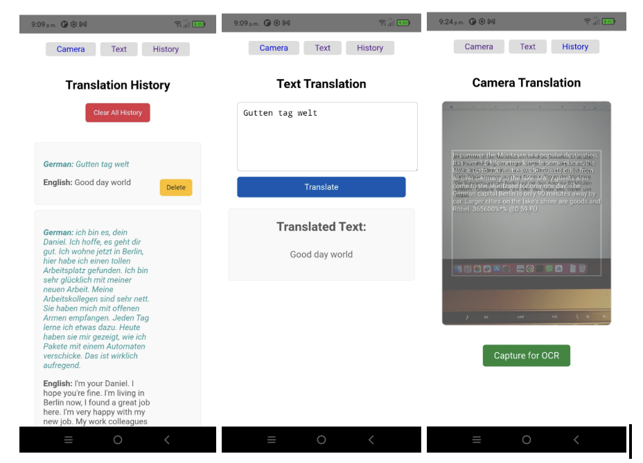

## Lang-Converter
An Android app for doing offline language translations.

A weekend hack/vibe-coding of an offline language translator for Android platform. Why you ask?
- Mostly, just curious how far vibe-coding will go with more esoteric requirements
- Works exactly the way I wanted it to

The peculiar requirements:
- Minimal Java if possible
- Can also operate as a stand-alone webapp when not packed into an APK
- Everything works offline

### Ab-Initio
Internet and ChatGPT seem to think this is possible. TesseractJS which I had used before handles the OCR, and suggested maybe Tensorflow.js for the translation model.

Running something like a quantized LLM as a service seems to be possible, but seemingly requires a lot more setup (aka hacks). Decided not to do this.

### Phase 0: Requirement
Asked Gemini-CLI to generate a `requirement.md` file based on a list of requirements (see `prompt.md`). The requirements it made make sense and have things mostly in the correct order, but some pruning was done around testing plans just to avoid getting into too much of a rabbit hole with so many unknowns already on hand.

In short: Vue application via Capacitor that runs OCR and tranlsation models offline. There are three views:
- Input view for direct text-to-text translation
- Camera view for translating captured images
- History view to show past translation attempts

### Phase 1: Basic app, setup and plumbing
Phase 1 consists of setting up the views and plumbing for building APKs. Asked Gemini-CLI to create a `phase1.md` file it can work off. This went off the rails rather quickly, `npm` and `vue` related processes installed into the wrong directories and had to start over several times.

Android Studio was a manual process, a few hiccups but mostly due to not knowing where things are located in the IDE and PATH settings. Build took a bit of time (initial package downloads) but mostly smooth, app opens and works with placeholder views.

### Phase 2: Translation model integration
Gemini wanted to use TensorflowJS, fine, but then claims that it couldn't find appropriate pretrained models but was going ahead anyway?? So instead prompted Gemini to research transformerJS instead, then had to further prompt Gemini to not use an outdated version of transformerJS. Gemini could not download the model file so they had to be pulled down manually from Hugginface (https://huggingface.co/Xenova/nllb-200-distilled-600M). The model has a lot more supported languages than I asked for, so the files are pretty hefty with encoder/decoder at 450mb each respectively. Gemini misconfigured offline mode for transformerJS several times, but all things considered had the page working after 5 minutes. Unsurprisingly running a big model on a webpage is a tad slow, but the plumbing works and maybe can search for a smaller model later.

### Intermission: Testing on actual device and Goldilocks
It turned out that the translation model is indeed too big. The test run resulted in the application crashing with OOM in the logs. Need something smaller.

#### Smaller: t5-small
Trying out quantized Google t5-small instead, this works but is English centric, so English => X is okay, but X => English is flaky.

See: https://huggingface.co/Xenova/t5-small

#### Bigger again: opus-mt-de-en
Trying out a dedicated model, this is 1/10th the size of NLLB model and is specific to DE/EN. Took 5-10 seconds to load the model into memory, but actually works okay once loaded. 

See: https://huggingface.co/Xenova/opus-mt-de-en

### Phase 3: Adding in historical translation entries
Gemini mixed up deprecated packages `@capacitor/storage` and `@capacitor/preferences`, otherwise it worked pretty well out of the box, a few small manual CSS tweaks was all.

### Phase 4: Camera and OCR integration
Things go off the rails on this one. Gemini messed up generating TesseractJS code, probably got confused over API changes across lib-versions. Vue's template was also messed up and looks like two different pages got smashed together. Prompting Gemini to fix ended up with some outlandish suggetions - so ended up fixing various errors manually.

### Intermission: Testing on actual device 
The Android build broke with a cryptic message about Zipfile error. TesseractJS's handling of file extensions is a bit weird as the CDN files are gzips but the offline files are not. Gemini says to modify the build gradle files which did not resolve the issue. Further complications were insufficient app previliges to operate the camera. Resolved both eventually via Googling and through vanilla LLM chats. 

### Phase 5: Translating camera images
This phase is scheduled to do overlays for OCR, history integration, and optimization/cleanup. Given the previous phase I did not want Gemini to opmize TesseractJS code, the remaining tasks are easy, so I just did them manually.

### Final testing and thoughts.
Each of the OCR and translation models take about 5-10 seconds to load. 
- Translation seems to work pretty well
- OCR Translation has some noises but able to translate most of the captured text

As expected, it is pretty slow. OCR-translation is not really usable interactively. Delegating requests to native models will likely be a lot faster as oppose to running in JS-engine/WASM. Gemini was pretty good up until the TesseractJS portion.

